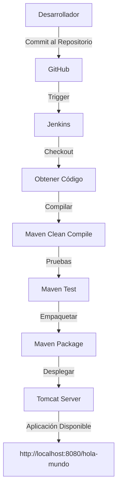

# Documentación del Pipeline de Integración Continua - Aplicación Web Cobra Kai

## Diagrama de Despliegue del Pipeline



### Descripción del Entorno

#### Servidor de Aplicación

- **Servidor:** Apache Tomcat 9.0
- **Ubicación de despliegue:** `C:\Program Files\Apache Software Foundation\Tomcat 9.0\webapps`
- **URL de acceso:** http://localhost:8080/hola-mundo/

#### Tecnologías Utilizadas

- **Lenguaje de Programación:** Java 8
- **Framework de Construcción:** Maven
- **Empaquetado:** WAR (Web Application Archive)
- **Servidor CI/CD:** Jenkins
- **Frontend:** HTML, CSS, JavaScript
- **Pruebas:** JUnit, Mockito

## Repositorio de la Aplicación

El código fuente de la aplicación se encuentra alojado en un repositorio público de GitHub:

[Enlace al Repositorio](https://github.com/MrBl4ck04/Pipeline_Jenkins.git)

> **Nota:** El repositorio ha sido compartido con la cuenta de usuario `gpalabral` como se solicitó.

## Evidencia de Integraciones/Commits

Se han realizado múltiples integraciones y commits a lo largo del desarrollo del proyecto, distribuidos en diferentes días para asegurar un desarrollo continuo y progresivo. Cada miembro del equipo ha contribuido con 10 commits.

### Resumen de Commits por Miembro

| Miembro | Número de Commits | Período |
|---------|-------------------|---------||
| Carlos Caba | 10 | 30/04/2025 - 04/05/2025 |
| Franz Carvajal | 10 | 30/04/2025 - 05/05/2025 |

## Código del Pipeline

A continuación se muestra el código del pipeline implementado en Jenkins (Jenkinsfile):

```groovy
pipeline {
    agent any

    tools {
        // Configuración de herramientas
        maven 'Maven'
        jdk 'JDK'
    }

    stages {
        stage('Checkout') {
            steps {
                // Obtener código del repositorio Git
                checkout scm
                echo '[+] Descarga de código completada'
            }
        }

        stage('Compilar') {
            steps {
                // Compilar el proyecto con Maven
                bat 'mvn clean compile'
                echo '[+] Compilación completada'
            }
        }

        stage('Pruebas') {
            steps {
                // Ejecutar pruebas unitarias
                bat 'mvn test'
                echo '[+] Pruebas completadas'
            }
            post {
                // Publicar resultados de pruebas
                always {
                    junit '**/target/surefire-reports/*.xml'
                }
            }
        }

        stage('Empaquetar') {
            steps {
                // Empaquetar la aplicación
                bat 'mvn package -DskipTests'
                echo '[+] Empaquetado completado'
            }
        }

        stage('Desplegar Tomcat') {
            steps {
                script {
                    // Ruta de Tomcat webapps con formato Windows (barras invertidas)
                    def tomcatWeb = 'C:\\Program Files\\Apache Software Foundation\\Tomcat 9.0\\webapps'

                    // Usar ruta relativa al workspace de Jenkins con formato Windows (barras invertidas)
                    def warFile = "${WORKSPACE}\\target\\hola-mundo.war"

                    // Verificar si el directorio target existe
                    bat "dir ${WORKSPACE}\\target"

                    // Verificar si el archivo WAR específico existe en la ruta del workspace
                    bat "if exist \"${warFile}\" (echo El archivo WAR existe) else (echo El archivo WAR NO existe)"

                    echo "[!] Intentando copiar: ${warFile}"

                    // Eliminar versión anterior del WAR en Tomcat si existe
                    bat "if exist \"${tomcatWeb}\\hola-mundo.war\" del \"${tomcatWeb}\\hola-mundo.war\""
                    bat "if exist \"${tomcatWeb}\\hola-mundo\" rmdir /s /q \"${tomcatWeb}\\hola-mundo\""
                    // Copiar el archivo .war al directorio webapps usando la ruta del workspace
                    bat "copy \"${warFile}\" \"${tomcatWeb}\\\""

                    echo "[+] Nuevo WAR desplegado correctamente"
                    sleep(time: 15, unit: 'SECONDS')

                    echo "[+] Aplicación desplegada en: http://localhost:8080/hola-mundo/"
                }
            }
        }
    }


    post {
        success {
            echo '[+] Pipeline ejecutado exitosamente!'
        }
        failure {
            echo '[!] El pipeline ha fallado. Por favor revise los logs para más detalles.'
        }
        always {
            // Limpiar el espacio de trabajo
            cleanWs()
        }
    }
}
```

### Descripción de las Etapas del Pipeline

1. **Checkout**: Obtiene el código fuente del repositorio Git.
2. **Compilar**: Compila el proyecto utilizando Maven con los comandos `clean compile`.
3. **Pruebas**: Ejecuta las pruebas unitarias del proyecto y publica los resultados.
4. **Empaquetar**: Genera el archivo WAR de la aplicación, omitiendo las pruebas para agilizar el proceso.
5. **Desplegar Tomcat**: Despliega el archivo WAR en el servidor Tomcat local, realizando las siguientes acciones:
   - Verifica la existencia del directorio target y el archivo WAR.
   - Elimina versiones anteriores de la aplicación en Tomcat.
   - Copia el nuevo archivo WAR al directorio webapps de Tomcat.
   - Muestra la URL de acceso a la aplicación desplegada.

## Instalación en Ambiente Local

1. **Requisitos Previos**:

   - Java JDK 8 o superior instalado
   - Maven instalado y configurado
   - Jenkins instalado y configurado
   - Apache Tomcat 9.0 instalado
   - Git instalado

2. **Pasos para el despliegue**:

   a. **Clonar el Repositorio**:

   ```bash
   git clone https://github.com/MrBl4ck04/Pipeline_Jenkins.git
   cd Pipeline_Jenkins
   ```

   b. **Configurar Jenkins**:

   - Crear un nuevo proyecto de tipo Pipeline en Jenkins
   - Configurar la integración con el repositorio Git
   - Especificar la ruta al Jenkinsfile en la configuración

   c. **Ejecutar el Pipeline**:

   - Iniciar la ejecución del pipeline manualmente o mediante un webhook
   - Mostrar el progreso de cada etapa en la interfaz de Jenkins
   - Verificar los logs de ejecución para confirmar el éxito de cada etapa

   d. **Verificar el Despliegue**:

   - Acceder a la aplicación desplegada en http://localhost:8080/hola-mundo/
   - Demostrar la funcionalidad de la aplicación web Cobra Kai
   - Mostrar cómo los cambios en el código se reflejan automáticamente tras ejecutar el pipeline

3. **Solución de Problemas Comunes**:
   - Verificar que Tomcat esté en ejecución antes de iniciar el pipeline
   - Asegurar que los puertos necesarios (8080 para Tomcat, 8081 para Jenkins) estén disponibles
   - Comprobar los permisos de escritura en el directorio webapps de Tomcat
